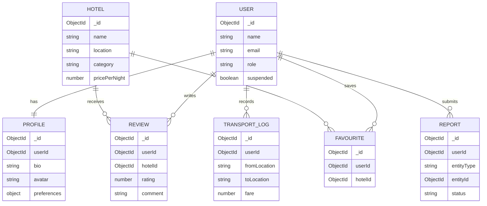

# DHOOMCHHALLE - Travelling WebApp
I am planning to build a webapp with my legend team, building this for travellers named as "dhoomchhalle" which means latchers (who roam around).
Planning to give some facilities regarding the travel (currently planned only for 1 city "Varanasi").

## Problems:
- The travellers don't know the actual price of public transport (easily get trapped by these public transport drivers)
- Don't know the best routes for destination with effective cost and less time taken.
- Best hotels based on their budget, including some details like - phone numbers, photos of hotels, and many more (including previous users feedbacks)
- Public transport timings (AC electric city bus, Non-AC bus, janrath bus timings, trains timings)

## Solutions: Providing a platform which has-
- actual cost of public transport (including petrol auto, CNG auto, E-rikshaw, buses, ropeways)
- providing the live traffic analysed best route for the destination
- best hostels according to their choice and budget
- Public transport timings (buses and trains timings)

## Tech Stack

### Client (React + Vite)
- React 19 + Vite 7 for a fast SPA build pipeline
- React Router 7 with lazy-loaded routes
- Tailwind CSS 4 for utility-first styling
- Axios client with interceptors for token/session handling
- Recharts + Chart.js for analytics visualizations
- GSAP + Motion + Lenis for modern UI interactions
- Leaflet + React Leaflet for map-driven route experiences

### Server (Express + MongoDB)
- Express 5 REST API with modular route architecture
- MongoDB + Mongoose for schema-based data modeling
- JWT access token + refresh token flow
- Security hardening via Helmet, Mongo sanitize, CORS, rate limiting
- Request validation via `express-validator`
- Media uploads via Multer + Cloudinary
- Email flows via Nodemailer (OTP + password reset)

### Dev & Deployment
- Vercel Analytics and Speed Insights on client
- Environment-based API origin and cookie settings
- Seed scripts for initial city data bootstrapping

## Core Design

Dhoomchhalle follows a modular, domain-driven structure so each feature can evolve independently.

- **Presentation Layer (Client):** Page routes, feature components, admin views, and dashboard tabs.
- **API Layer (Server):** Versioned endpoints (`/api/v1`) with clear controller boundaries.
- **Domain Modules:** `user`, `hotel`, `review`, `favourite`, `report`, `transportLog`, `admin`, `map`.
- **Shared Middleware:** Auth, role checks, validation, upload pipeline, rate-limiting, and error handling.
- **Data Layer:** MongoDB collections with indexes, references, and TTL policies for secure/session-aware workflows.

### Request Flow (High Level)
1. Client route/service triggers API call via centralized Axios client.
2. Middleware validates token, permissions, and request payload.
3. Controller delegates domain logic to service/model layer.
4. Response returns normalized JSON for UI rendering.

## Authentication, Session & User Dashboard

- JWT-based authentication with access + refresh token handling.
- Optional 2FA via OTP email verification during login/security actions.
- Auth middleware validates token, checks blacklist, and confirms user still exists and is active.
- Logout blacklists access token and revokes refresh token to prevent reuse.
- Protected user dashboard (`/dashboard`) exposes profile, saved hotels, reviews, transport logs, settings, and reports.
- Role-aware navigation redirects admins to `/admin` for moderation and system operations.

## ER DIAGRAM (Level 1 - Structure)



`REPORT` uses a polymorphic reference (`entityType` + `entityId`) to target hotels, reviews, transport issues, or other entities.

## Future Monetization (Think Big)
- Hotel promotions
- Transport advertisement
- Premium route planner
- Affiliate booking

## Folder Structure

### Client (`client/`)
```text
client/
|-- public/
|-- src/
|   |-- assets/
|   |-- components/
|   |   |-- Admin/
|   |   |-- auth/
|   |   |-- common/
|   |   |-- hotels/
|   |   |-- modals/
|   |   |-- reviews/
|   |   |-- transport/
|   |   |-- user-dashboard/
|   |   `-- user-profile/
|   |-- context/
|   |-- hooks/
|   |-- layouts/
|   |-- lib/
|   |   `-- apiClient.js
|   |-- pages/
|   |-- routes/
|   |-- services/
|   |   |-- api/
|   |   |   `-- adminAPI.js
|   |   |-- auth.service.js
|   |   |-- favourite.service.js
|   |   |-- hotel.service.js
|   |   |-- profile.service.js
|   |   |-- report.service.js
|   |   |-- review.service.js
|   |   |-- transport.service.js
|   |   |-- transportLog.service.js
|   |   `-- userId.service.js
|   |-- utils/
|   |-- App.jsx
|   `-- main.jsx
|-- package.json
`-- vite.config.js
```

### Server (`server/`)
```text
server/
|-- config/
|   `-- db.js
|-- middlewares/
|   |-- auth.middleware.js
|   |-- role.middleware.js
|   |-- roleBasedAccess.middleware.js
|   |-- rateLimit.middleware.js
|   |-- upload.middleware.js
|   |-- validate.middleware.js
|   `-- error.middleware.js
|-- modules/
|   |-- user/
|   |-- admin/
|   |-- hotel/
|   |-- profile/
|   |-- review/
|   |-- favourite/
|   |-- report/
|   |-- transportLog/
|   |-- map/
|   |-- transport/
|   |-- route/
|   `-- timing/
|-- services/
|   |-- cloudinary.service.js
|   `-- email.service.js
|-- seed/
|-- utils/
|-- app.js
|-- server.js
`-- package.json
```

## Functionalities

- **Smart authentication:** Register/login/logout, refresh-token flow, OTP-based 2FA, password reset, login activity tracking.
- **Secure session management:** Token blacklist on logout, middleware-level revoked/deleted-user checks, protected routes.
- **User dashboard:** Profile summary, saved hotels, personal reviews, transport history, report tracking, avatar/profile updates.
- **Hotel exploration:** Browse listings, open hotel details, review and rating ecosystem with helpful votes.
- **Map + route intelligence:** Place discovery by map bounds, route computation/ranking, fare estimation, popular route insights.
- **Admin control center:** Dashboard stats, user moderation, review/report handling, hotel management, analytics, platform settings.
- **Production-minded API:** Validation, security middleware, rate limiting, upload pipeline, and modular domain boundaries.

## Run Website
- Clone Repo
```
git clone https://github.com/coderujwal3/Dhoomchhalle.git
cd Dhoomchhalle
```
- for frontend
```
cd client
npm install
npm run dev
```
- for backend
```
cd server
npm install
npm run dev
```

## Website landing page


## User Profile QR Code


## User Dashboard Look


## User Profile Look


# Mobile App Dhoomchhalle
## NOTE => This will be added soon in this repo again (it has been removed from here, because it has several high risk vulnerabilites in it, after fixation it will be deployed again. Thank you for understanding).
## Mobile Landing page


# App Dev requirements
- Android Studio
- Emulators (`pixel 5`,`pixel 7 pro`,`pixel tablet`)
- React-Native
- expo bundler
- typescript

## download packages
```
cd mobile
npm install
```

## Start app in emulator
```
npm run android    -     (for android - you can run using expo command - expo start --android)
npm run ios        -     (for ios - you can run using expo command - expo start --ios)
npm run tablet     -     (for tablet - you can run using expo command - expo start --tablet)
```

